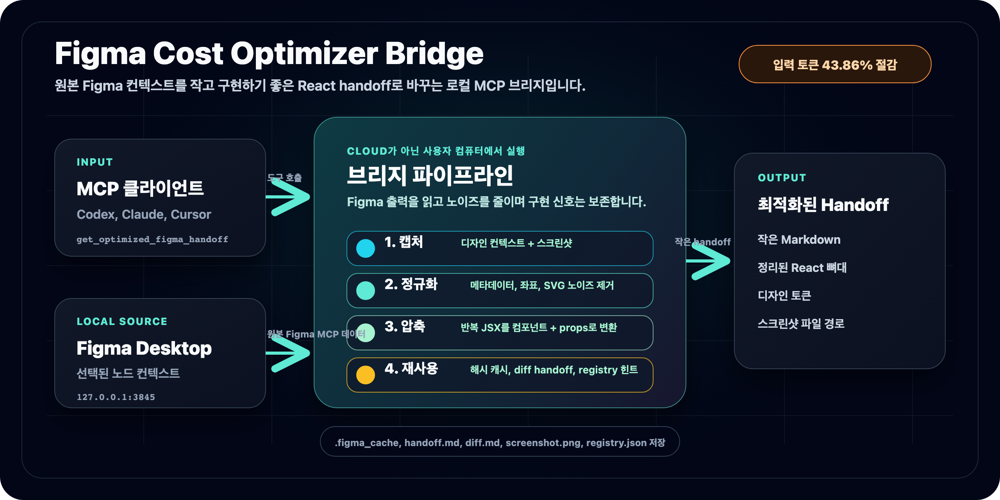

# Figma Cost Optimizer Bridge

<div align="right">
  <a href="./README.md">English</a> | <strong>한국어</strong>
</div>



Figma Cost Optimizer Bridge는 Figma Desktop의 디자인 컨텍스트를 LLM 코딩 에이전트가 구현하기 좋은 작고 실용적인 React handoff로 바꾸는 로컬 MCP 서버입니다.

이 브리지는 MCP 클라이언트와 Figma Desktop의 로컬 MCP 엔드포인트 사이에 위치합니다. 메타데이터, 절대 좌표, 반복되는 class 문자열, 인라인 SVG로 가득한 원본 `get_design_context` 출력을 그대로 넘기지 않고, 정제된 React 뼈대 코드, 디자인 토큰, 재사용 가능한 반복 구조, 스크린샷 경로가 담긴 작은 Markdown handoff를 반환합니다.

결과적으로 입력 토큰 비용과 컨텍스트 노이즈를 줄이면서도, 코딩 에이전트가 UI를 정확하게 구현하는 데 필요한 정보는 보존합니다.

## 벤치마크 요약

최신 재현 가능 fixture: Ditto `BatteryPro`, Figma node `2478-32218`, 측정일 `2026-06-13`.

| 경로 | 입력 문자 수 | 추정 텍스트 토큰 | 이미지 토큰 | 총 추정 토큰 | 픽셀 유사도 |
|---|---:|---:|---:|---:|---:|
| 공식 Figma MCP raw | 52,696 | 13,174 | 510 | 13,684 | 92.97% |
| Bridge handoff | 30,727 | 7,682 | 0 | 7,682 | 96.77% |

**추정 입력 토큰 절감률: 43.86%**

기존 handoff에서 가장 큰 병목이던 반복 인스턴스 데이터 섹션은 이제 **3,978자**이며, 목표였던 10KB 아래로 줄었습니다. 전체 리포트는 [docs/BENCHMARK_RESULTS_KR.md](./docs/BENCHMARK_RESULTS_KR.md)를 참고하세요.

## 주요 기능

- **토큰 효율적인 handoff:** Figma 원본의 불필요한 메타데이터, 절대 좌표, 반복 Tailwind 토큰, `data-*` 속성, 인라인 SVG 블록을 제거하거나 압축합니다.
- **스크린샷 path 모드:** 기본값으로 이미지 데이터를 인라인하지 않고 로컬에 저장한 뒤 절대 경로만 반환합니다.
- **반복 subtree dedupe:** 반복되는 JSX 구조를 컴포넌트 정의 1개와 인스턴스 데이터로 변환합니다.
- **공통 class 추출:** 모든 인스턴스가 공유하는 class 토큰은 컴포넌트 템플릿에 남기고, 차이만 prop으로 전달합니다.
- **기본 prop 값:** 자주 반복되는 슬롯 값을 컴포넌트 기본값으로 올려 인스턴스에서 생략할 수 있게 합니다.
- **해시 캐시:** raw Figma 응답이 바뀌지 않았으면 이전 handoff를 재사용합니다.
- **Diff handoff:** 이미 본 컴포넌트는 변경된 줄만 반환하고, 변경량이 너무 크면 자동으로 전체 handoff로 폴백합니다.
- **로컬 컴포넌트 레지스트리:** 추출되었거나 프로젝트에서 스캔한 컴포넌트를 기록하고 이후 handoff에서 재사용을 제안합니다.
- **선택적 Ollama 사전 분석:** 로컬 Ollama가 있으면 색상, 텍스트, 요약 분석을 추가합니다. Ollama가 없어도 파이프라인은 계속 동작합니다.
- **벤치마크 하니스:** raw vs bridge 입력 토큰, Playwright 렌더 결과, `pixelmatch` 픽셀 유사도를 측정합니다.

## 설치

npm에서 설치:

```bash
npm install -g decrease-token-figma
figma-bridge
```

GitHub에서 직접 설치:

```bash
npm install -g github:junseo2323/decrease-token-figma
figma-bridge
```

로컬 개발용 설치:

```bash
git clone https://github.com/junseo2323/decrease-token-figma.git
cd decrease-token-figma
npm install
npm run build
npm link
figma-bridge
```

Ollama는 `figma-bridge` 시작 시 자동으로 준비됩니다. 직접 미리 준비하려면 다음을 실행하세요.

```bash
npm run setup
```

## MCP 클라이언트 설정

Claude Desktop, Codex, Cursor 등 MCP 클라이언트에 아래처럼 등록합니다.

```json
{
  "mcpServers": {
    "figma-cost-optimizer-bridge": {
      "command": "npx",
      "args": ["-y", "decrease-token-figma"],
      "env": {
        "FIGMA_BRIDGE_ROOT": "/absolute/path/to/your/app"
      }
    }
  }
}
```

GitHub 버전을 바로 실행하려면:

```json
{
  "mcpServers": {
    "figma-cost-optimizer-bridge": {
      "command": "npx",
      "args": ["-y", "github:junseo2323/decrease-token-figma"],
      "env": {
        "FIGMA_BRIDGE_ROOT": "/absolute/path/to/your/app"
      }
    }
  }
}
```

## 필수 조건

- Figma Desktop이 실행 중이어야 합니다.
- Figma local MCP 엔드포인트가 `127.0.0.1:3845`에서 접근 가능해야 합니다.
- handoff 요청 전에 Figma 노드를 선택해야 합니다.
- `FIGMA_BRIDGE_ROOT` 또는 도구 인자 `projectRoot`가 로컬 앱 프로젝트를 가리켜야 합니다.

## MCP 도구

### `get_optimized_figma_handoff`

현재 선택된 Figma 노드를 가져와 최적화된 Markdown handoff와 스크린샷 정보를 반환합니다.

| 인자 | 값 | 기본값 | 설명 |
|---|---|---|---|
| `projectRoot` | 절대 경로 | `FIGMA_BRIDGE_ROOT` 또는 cwd | 에셋과 캐시를 저장할 프로젝트 루트 |
| `screenshot` | `path` / `inline` / `none` | `path` | `path`는 PNG를 캐시에 저장하고 절대 경로만 반환합니다. `inline`은 파일 접근이 없는 클라이언트용입니다 |
| `mode` | `auto` / `full` / `diff` | `auto` | 이전 버전이 있으면 diff, 없으면 full handoff를 반환합니다 |
| `force_refresh` | boolean | `false` | raw 해시가 같아도 캐시를 무시하고 다시 캡처합니다 |

### `sync_component_registry`

`<projectRoot>/src/components/*.tsx`를 스캔해 로컬 컴포넌트 레지스트리를 갱신합니다. 이후 handoff에서 이 레지스트리를 바탕으로 컴포넌트 재사용을 제안하거나 강제할 수 있습니다.

## 작동 흐름

1. Figma Desktop에서 노드를 선택합니다.
2. LLM이 `get_optimized_figma_handoff`를 호출합니다.
3. 브리지가 로컬 Figma MCP 엔드포인트에서 raw design context와 screenshot을 가져옵니다.
4. 이미지 에셋을 `src/assets` 또는 설정된 asset directory에 저장합니다.
5. raw TSX를 정제하고 반복 구조를 압축한 뒤, 선택적으로 Ollama 분석을 추가합니다.
6. LLM은 handoff Markdown과 screenshot을 기반으로 UI를 구현합니다.

## 캐시 구조

```text
.figma_cache/
  nodes/ChatScreen_a3f29c01/
    raw.txt
    handoff.md
    diff.md
    screenshot.png
    meta.json
  registry.json
```

- raw 응답이 바뀌지 않았으면 캐시된 handoff를 재사용합니다.
- 컴포넌트당 최신 2개 버전을 유지합니다.
- `mode: auto`에서는 이전 버전이 있을 때 diff handoff를 생성합니다.

## 환경 변수

| 변수 | 설명 |
|---|---|
| `FIGMA_BRIDGE_ROOT` | 에셋과 캐시 기준 프로젝트 루트 |
| `FIGMA_BRIDGE_CACHE_DIR` | 캐시 디렉토리 override |
| `FIGMA_BRIDGE_ASSET_DIR` | 이미지 에셋 디렉토리 override |
| `OLLAMA_BIN` | 특정 Ollama 실행 파일 경로 |
| `FIGMA_BRIDGE_OLLAMA_MODEL` | 사용할 Ollama 모델. 기본값: `llama3.2` |
| `FIGMA_BRIDGE_OLLAMA_AUTO_INSTALL=0` | 런타임 Ollama 자동 설치 비활성화 |
| `FIGMA_BRIDGE_OLLAMA_AUTO_PULL=0` | 런타임 모델 다운로드 비활성화 |

## npm 스크립트

```bash
npm run build              # TypeScript 빌드
npm test                   # 단위 테스트
npm run setup              # Ollama 설치/실행 및 기본 모델 다운로드
npm run measure            # .figma_cache/handoff.md 토큰 크기 추정
npm run benchmark:capture  # Figma 벤치마크 fixture 캡처
npm run benchmark:tokens   # raw vs bridge 입력 토큰 측정
npm run benchmark:diff     # Vite 렌더 후 픽셀 diff 계산
npm run benchmark:blind    # blind multi-run LLM 벤치마크 실행
npm run benchmark:summary  # blind 벤치마크 요약 재생성
```

## 벤치마크 재현

```bash
npm install
npm run build
npx playwright install chromium

# Figma Desktop을 열고 local MCP를 3845 포트에서 활성화한 뒤,
# 대상 노드를 선택한 상태에서 캡처합니다.
npm run benchmark:capture -- ditto-battery-pro 2478-32218 WlvYAu5ONnUe7kVcDtmuqk
npm run benchmark:tokens -- ditto-battery-pro
npm run benchmark:diff -- ditto-battery-pro
```

산출물은 다음 경로에 저장됩니다.

```text
benchmarks/fixtures/<slug>/
benchmarks/results/<slug>/
```

더 엄밀한 비교를 원하면 같은 모델, temperature, 스크린샷 입력, 출력 규칙, compile-repair 정책을 고정하고 텍스트 입력만 바꿔 blind benchmark를 실행하세요.

```bash
export ANTHROPIC_API_KEY=...

npm run benchmark:blind -- ditto-842-7750 \
  --provider anthropic \
  --model claude-sonnet-4-5-20250929 \
  --runs 5 \
  --temperature 0 \
  --max-repairs 1 \
  --experiment-id sonnet45-t0-r5
```

## 런타임 모델

이 프로젝트는 원격 웹 서비스로 실행하는 것이 주목적이 아닙니다. 브리지는 사용자의 로컬 Figma Desktop 선택, 로컬 파일시스템, 선택적 로컬 Ollama 서버에 접근해야 합니다. 실제 런타임은 npm 또는 GitHub 설치로 실행하고, GitHub Pages는 문서와 벤치마크 리포트 공개 용도로 사용하세요.

문서:

- English Pages: https://junseo2323.github.io/decrease-token-figma/
- 한국어 Pages: https://junseo2323.github.io/decrease-token-figma/index.ko.html
- 벤치마크 리포트: https://junseo2323.github.io/decrease-token-figma/BENCHMARK_RESULTS_KR.html

## LLM 구현 가이드

- 시각적 레이아웃, 여백 흐름, 정렬은 스크린샷을 보고 결정합니다.
- 정확한 텍스트, 색상, 폰트 굵기, 디자인 토큰은 handoff 코드에서 가져옵니다.
- 기계적으로 추출된 에셋 변수명은 구현 시 의미 있는 이름으로 바꿉니다.
- 인라인 SVG placeholder는 가능한 한 `lucide-react` 같은 아이콘 컴포넌트로 대체합니다.

## 라이선스

MIT
