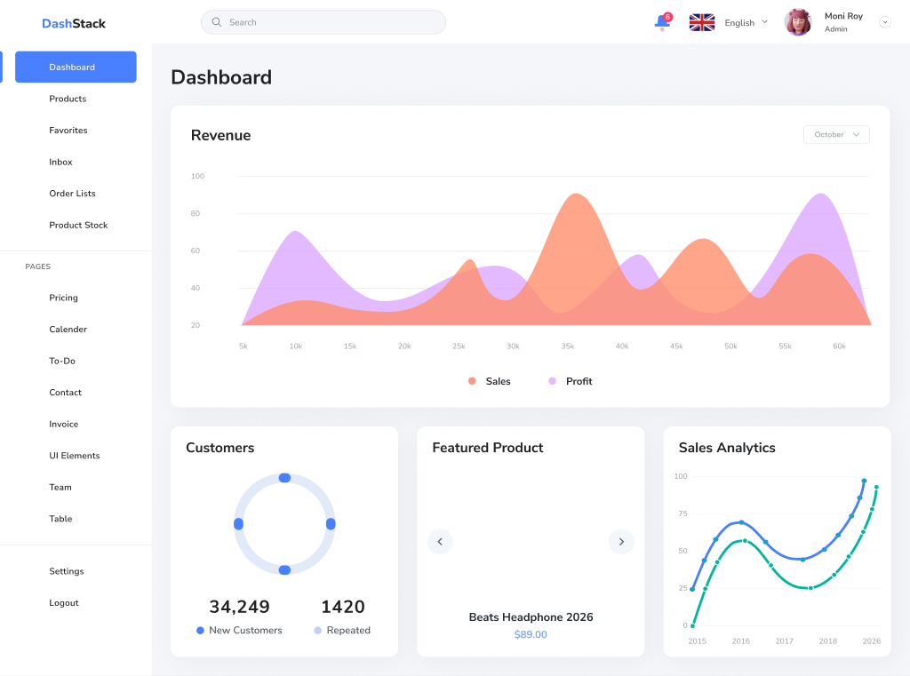
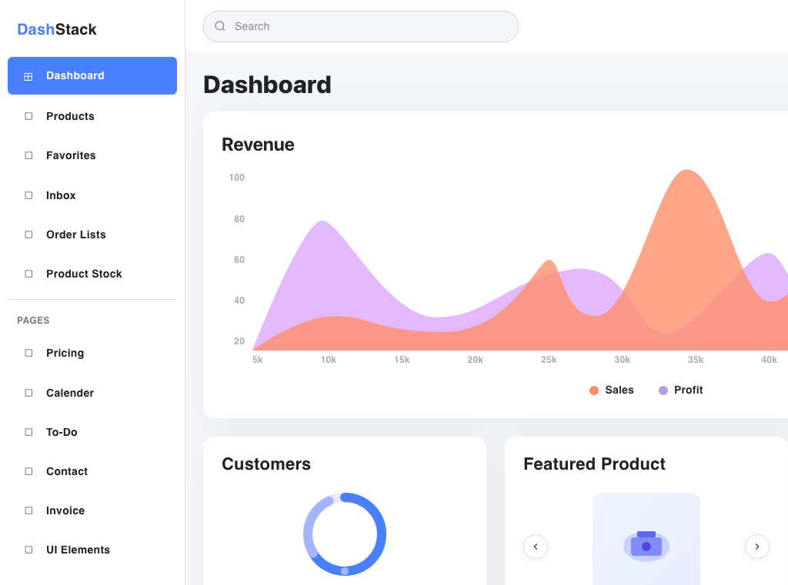
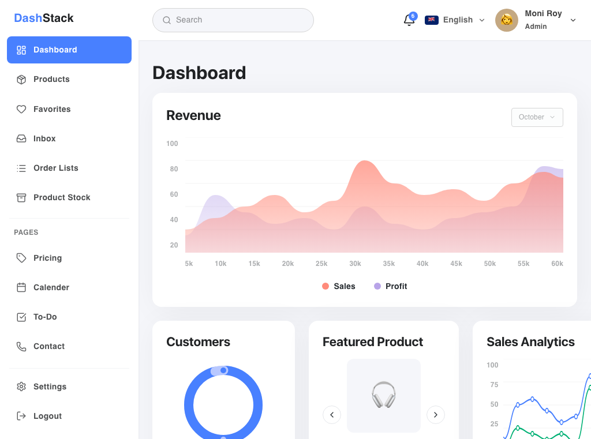
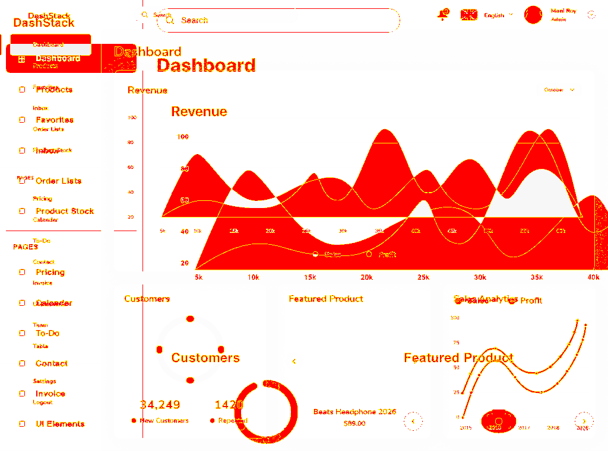
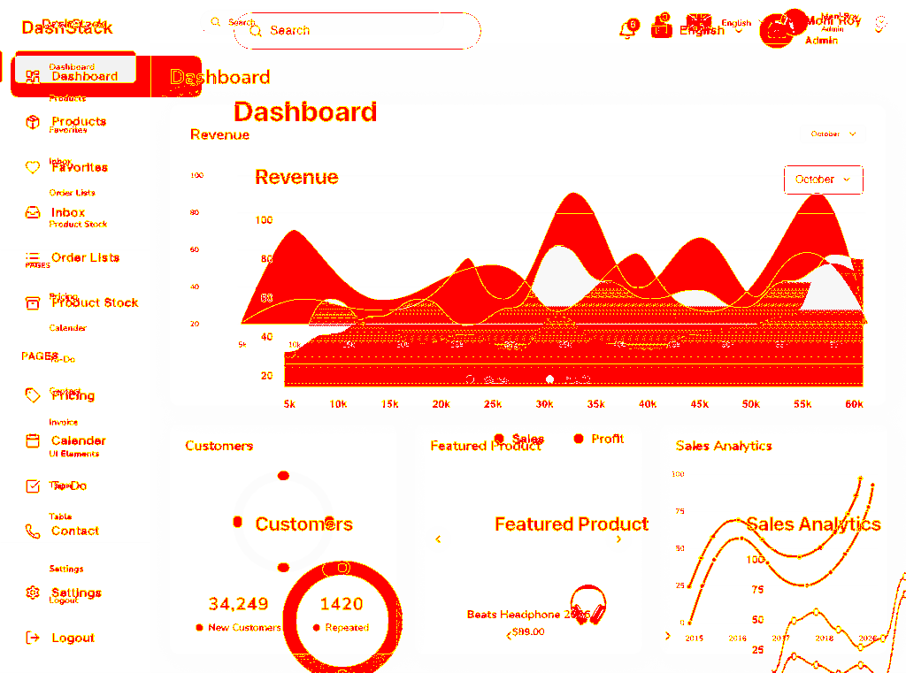

# Benchmark Results: DashStack Dashboard

<div align="right">
  <strong>English</strong> | <a href="./BENCHMARK_RESULTS_KR.html">한국어</a>
</div>

This report records the current reproducible benchmark for Figma Cost Optimizer Bridge.

- Fixture: `dashstack-dashboard`
- Figma node: `2791-32584`
- File key: `WlvYAu5ONnUe7kVcDtmuqk`
- Captured viewport: `1024 x 761`
- Measurement date: `2026-06-16`
- Method: blind multi-run — `anthropic / claude-sonnet-4-6`, 3 runs, temperature `0`, compile-only repairs `1`

## Summary

Token columns are a `chars / 4` estimate (vanilla image tokens `width * height / 750`). Pixel similarity is the mean of the 3 blind runs.

| Path | Input chars | Est. text tokens | Image tokens | Total est. tokens | Pixel similarity (mean) |
|---|---:|---:|---:|---:|---:|
| Official Figma MCP raw | 51,543 | 12,886 | 1,040 | 13,926 | 83.12% |
| Bridge handoff | 26,929 | 6,733 | 0 | 6,733 | 84.76% |

**Estimated input-token saving: 51.65%.** Across 3 blind runs the bridge arm was also **+1.65 pp** more similar to the reference on average (range −0.12 to +3.28 pp) — the bridge spent roughly half the input tokens without losing visual accuracy.

| Run | Savings % | Vanilla sim. | Bridge sim. | Delta pp |
|---|---:|---:|---:|---:|
| run-001 | 51.65 | 81.69 | 84.97 | +3.28 |
| run-002 | 51.65 | 84.34 | 84.22 | −0.12 |
| run-003 | 51.65 | 83.32 | 85.10 | +1.78 |

The images below are from the representative run (`run-003`).

## Visual Comparison

### Reference



### Official Raw Render



Built from official Figma MCP raw context plus the screenshot. It is structurally close but less faithful than the bridge render at equal effort, while costing ~2x the input tokens.

### Bridge Render



Built from the optimized handoff Markdown plus the same screenshot. The model reconstructed the sidebar, top bar, revenue area chart, and the three summary cards closely while using fewer estimated input tokens.

## Pixel Diff

### Official Raw Diff



### Bridge Diff



## Reproduce The Benchmark

```bash
npm install
npm run build
npx playwright install chromium

# Figma Desktop must be open, local MCP must be enabled on port 3845,
# and the target node must be selected.
npm run benchmark:capture -- dashstack-dashboard 2791-32584 WlvYAu5ONnUe7kVcDtmuqk
npm run benchmark:tokens -- dashstack-dashboard

# Blind multi-run comparison (set ANTHROPIC_API_KEY first):
npm run benchmark:blind -- dashstack-dashboard \
  --provider anthropic --model claude-sonnet-4-6 \
  --runs 3 --temperature 0 --max-repairs 1 --experiment-id sonnet46-t0-r3
```

Benchmark artifacts live in:

```text
benchmarks/fixtures/dashstack-dashboard/
benchmarks/results/dashstack-dashboard/
```

## Caveats

This is a practical local benchmark on a single screen, not a universal claim that the bridge always improves visual accuracy. The blind harness keeps the provider, model, temperature, screenshot input, output contract, and compile-repair policy identical while only the text input changes, so the comparison is fair, but results vary by screen and model. Report model name, run count, temperature, repair count, and compile failures alongside any number.

## Recommended Distribution

This project should run locally, not primarily as a hosted web service. The MCP bridge needs access to:

- the user's local Figma Desktop MCP endpoint at `127.0.0.1:3845`
- the user's local project filesystem for assets and cache
- optional local Ollama for pre-analysis

Recommended distribution:

1. GitHub repository for source, docs, benchmarks, and issues.
2. npm package for local installation through `npx` or global install.
3. GitHub Pages for documentation and benchmark reports.

Do not use Vercel, Render, or Fly as the main runtime unless the project is redesigned as a remote MCP service with authentication and a different Figma access model.

## Example MCP Client Config

```json
{
  "mcpServers": {
    "figma-cost-optimizer-bridge": {
      "command": "npx",
      "args": ["-y", "decrease-token-figma"],
      "env": {
        "FIGMA_BRIDGE_ROOT": "/absolute/path/to/your/app"
      }
    }
  }
}
```
