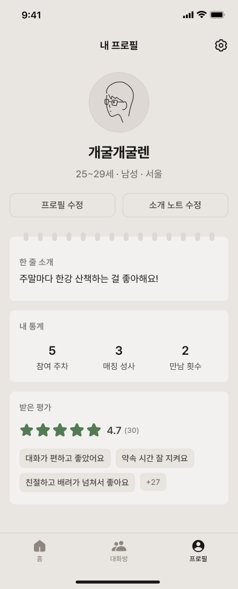
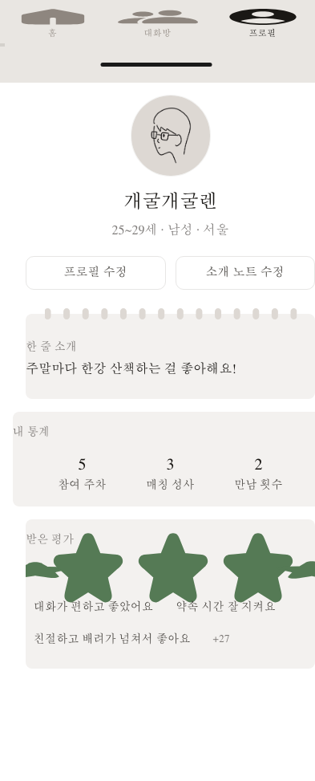

# 벤치마크 결과: Ditto BatteryPro

<div align="right">
  <a href="./BENCHMARK_RESULTS.html">English</a> | <strong>한국어</strong>
</div>

V5 Figma Cost Optimizer Bridge의 첫 재현 가능한 벤치마크입니다.

- Fixture: `ditto-battery-pro`
- Figma node: `2478-32218`
- File key: `WlvYAu5ONnUe7kVcDtmuqk`
- 캡처 viewport: `393 x 973`
- 측정일: `2026-06-13`

## 요약

| 경로 | 입력 문자 수 | 추정 텍스트 토큰 | 이미지 토큰 | 총 추정 토큰 | 픽셀 유사도 |
|---|---:|---:|---:|---:|---:|
| 공식 Figma MCP raw | 52,696 | 13,174 | 510 | 13,684 | 92.97% |
| Bridge handoff | 30,727 | 7,682 | 0 | 7,682 | 96.77% |

**추정 입력 토큰 절감률: 43.86%**

반복 인스턴스 데이터 표 최적화는 성공했습니다. 반복 데이터 섹션은 **3,978자**로 줄어 10KB 목표를 충분히 만족했습니다. 아직 남은 큰 덩어리는 최적화된 코드 블록과 반복 컴포넌트 정의입니다.

## 시각 비교

### 기준 이미지



### Vanilla 렌더



공식 Figma MCP raw TSX를 최소 보정해 직접 렌더한 결과입니다. 구조는 가깝지만 하단 탭바가 위쪽에 렌더되고 별점 아이콘이 과도하게 크게 나오는 문제가 있습니다.

### Bridge 렌더


Bridge handoff와 스크린샷을 기반으로 구현한 결과입니다. 더 적은 입력 토큰으로 기준 이미지에 더 가까운 화면을 만들었습니다.

## Pixel Diff

### Vanilla diff


### Bridge diff


## 재현 방법

```bash
npm install
npm run build
npx playwright install chromium

# Figma Desktop을 켜고 local MCP를 3845 포트에서 활성화한 뒤,
# 대상 노드를 선택한 상태에서 실행합니다.
npm run benchmark:capture -- ditto-battery-pro 2478-32218 WlvYAu5ONnUe7kVcDtmuqk
npm run benchmark:tokens -- ditto-battery-pro
npm run benchmark:diff -- ditto-battery-pro
```

결과 파일 위치:

```text
benchmarks/fixtures/ditto-battery-pro/
benchmarks/results/ditto-battery-pro/
```

## 해석상 주의

이 벤치마크는 실용적인 로컬 비교이며, 같은 모델에게 blind로 각각 구현을 맡긴 엄밀한 실험은 아닙니다. Vanilla 결과는 raw Figma TSX를 최소 보정해 직접 렌더한 baseline이고, Bridge 결과는 최적화 markdown과 스크린샷을 보고 구현한 산출물입니다. 하니스는 이미 준비되어 있으므로 같은 구현 LLM에 raw와 bridge를 각각 입력해 더 엄밀한 비교를 만들 수 있습니다.

## 배포 방식

이 프로젝트는 원격 웹 서버에 올려 쓰는 제품이 아닙니다. 브리지는 로컬 MCP stdio 서버이며 다음에 접근해야 합니다.

- 사용자의 Figma Desktop local MCP endpoint: `127.0.0.1:3845`
- 사용자의 로컬 프로젝트 파일시스템
- 선택적으로 로컬 Ollama

권장 배포 방식:

1. GitHub 저장소: 소스, 이슈, 문서, 벤치마크 공개
2. npm 패키지: 사용자가 `npx` 또는 전역 설치로 로컬 실행
3. GitHub Pages: 랜딩 페이지와 벤치마크 결과 공개

Vercel, Render, Fly 같은 원격 런타임은 현재 구조의 주 배포 대상이 아닙니다. 원격 서비스로 만들려면 인증, Figma 접근 방식, 파일시스템 모델을 다시 설계해야 합니다.
