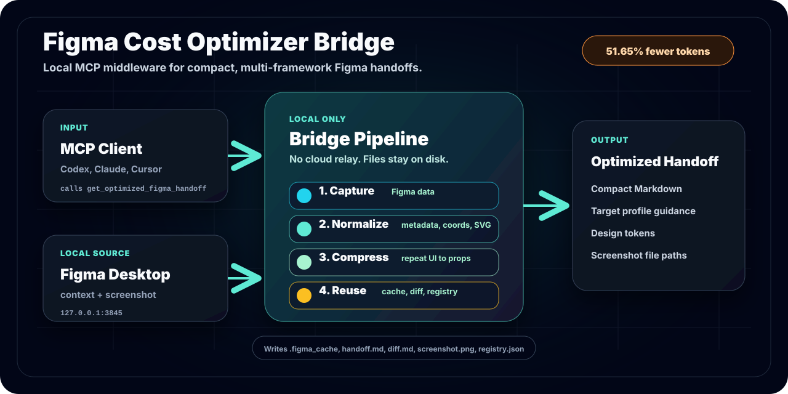

# Figma Cost Optimizer Bridge

<div align="right">
  <strong>English</strong> | <a href="./index.ko.md">한국어</a>
</div>



Local MCP bridge that compresses Figma Desktop design context into token-efficient multi-framework web handoffs for LLM coding agents.

## Benchmark Snapshot

Latest fixture: `DashStack Dashboard`, measured on `2026-06-16` (blind 3-run, `claude-sonnet-4-6`).

| Path | Total estimated input tokens | Pixel similarity (mean) |
|---|---:|---:|
| Official Figma MCP raw | 13,926 | 83.12% |
| Bridge handoff | 7,232 | 84.76% |

**Estimated input-token saving: 48.07%** — and the bridge arm was +1.65 pp more similar to the reference on average.

[Read the full benchmark report](./BENCHMARK_RESULTS.md)


## Install

```bash
npm install -g decrease-token-figma
figma-bridge
```

## MCP Client Config

```json
{
  "mcpServers": {
    "figma-cost-optimizer-bridge": {
      "command": "npx",
      "args": ["-y", "decrease-token-figma"],
      "env": {
        "FIGMA_BRIDGE_ROOT": "/absolute/path/to/your/app"
      }
    }
  }
}
```

## Codex and Claude Code Setup

Run these commands from the app project root so `FIGMA_BRIDGE_ROOT` points to the right filesystem location.

```bash
codex mcp add figma-cost-optimizer-bridge \
  --env FIGMA_BRIDGE_ROOT="$PWD" \
  -- npx -y decrease-token-figma
```

```bash
claude mcp add -s local figma-cost-optimizer-bridge \
  -e FIGMA_BRIDGE_ROOT="$PWD" \
  -- npx -y decrease-token-figma
```

Check or remove the server:

```bash
codex mcp list
claude mcp list

codex mcp remove figma-cost-optimizer-bridge
claude mcp remove figma-cost-optimizer-bridge
```

On startup, the bridge prepends a guardrail to `AGENTS.md` and `CLAUDE.md` in `FIGMA_BRIDGE_ROOT` so agents use only `figma-cost-optimizer-bridge` for Figma work and do not fall back to the official Figma MCP. Set `FIGMA_BRIDGE_WRITE_AGENT_RULES=0` to disable this.

## Why It Runs Locally

This is not a hosted web service. The bridge needs access to:

- Figma Desktop local MCP on `127.0.0.1:3845`
- the user's project filesystem for cache and assets
- local Ollama analysis, prepared automatically and required for handoff generation

Use npm or GitHub for installation. Use GitHub Pages for docs and benchmark reports.

## Links

- [GitHub repository](https://github.com/junseo2323/decrease-token-figma)
- [npm package](https://www.npmjs.com/package/decrease-token-figma)
- [Korean page](./index.ko.md)
